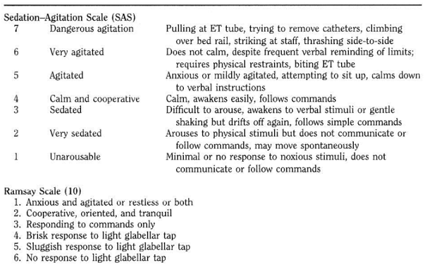

# Ethnic Disparities in Patients' Exposure to Deep Sedation

## Overview of the project 

 The goal of the project was to build an interactive visualization that sensitizes critical care teams to ethnic disparities in the exposure to deep sedation on patients with acute respiratory distress syndrome (ARDS). This is an imperative undertaking because research studies show that the level of sedation a patient with ARDS receives is associated with increased incidence of delirium, worse functional outcomes, and higher within one-year mortality. The first step in developing this prototype was understanding two key concepts of the project: (1) ARDS, and, (2) procedural sedation and analgesia (PSA), the medical technique of giving a patient sedating/dissociative medication. According to the National Heart, Lung, and Blood institute, ARDS is a life-threatening condition in which fluid collects in the lungs' air sacs (pulmonary edema), depriving organs of oxygen, that occurs mainly on those who are critically ill or have significant injuries. This condition can develop at any age and quickly deteriorate[1].

  
   
  

 ARDS is one of the most severe conditions in critical illness and also one of the most challenging regarding the management of analgesia and sedation. The lungs fill with fluid, severely impairing gas exchange. The patient’s blood oxygen level drops dramatically, and breathing becomes rapid and labored. The ability to independently maintain ventilatory function may be impaired and so patients may require assistance in maintaining a patent airway. In the presence of uncontrolled inspiratory effort, severe lung injury and asynchronies, is as typical with severe cases of ARDS, spontaneous ventilation might worsen lung edema, induce diaphragm dysfunction and lead to muscles exhaustion and prolonged weaning. In such a dire situation, mechanical ventilation (MV) is required to support breathing and to increase oxygen levels in the blood.

 
    

 Procedural sedation and analgesia is useful in patients with ARDS to the extent that it helps improve their tolerance of MV and decreases their oxygen consumption. Now while PSA facilitates comfort and ventilator tolerance during MV, sedation is a continuum and a patient can easily slip into a deeper state. For this reason, a physician performing PSA must be prepared to care for a patient at least one level of sedation greater than that intended. In order to do this, a practitioner must be able to recognize the level of sedation and understand the increasing cardiopulmonary risk that is associated with deeper sedation.

   

 Clinical practice guidelines for analgesia and sedation in the ICU have consistently focused on early rehabilitation and quick ventilator liberation. To achieve these goals, treatment of pain, minimization of sedation, prevention of delirium, and improved patient communication are the key components. However, some ARDS patients require deep sedation especially during the early phase of admission but only a few studies on analgesia/sedation have evaluated patients during this early period. Therefore there is still work to be done in providing guidance that not only supports clinicians in their management of sedation/analgesia in ARDS patients but also cements their efforts in rectifying the well documented disparities in the health outcomes of ARDS patients. The population-based epidemiological study[2] that motivated this project investigated and revealed racial and ethnic disparities in ARDS patients' exposure to deep sedation, which when considered in light of the evidence of the adverse physiologic and cognitive effects of deep sedation, paints an alarming and disconcerting picture. (Armstrong-Hough, M. and et.al., 2022). The primary objective here is to develop an interactive visualization that makes critical care clinicians more cognizant of those investigative findings in their decision-making.

  
   
  
## Description of Key Outcome Variables

  

 
 In the research study, deep sedation is defined as "... as the proportion of days during which the patient is deeply sedated, repeatedly measured once daily for the first five days that a patient is alive and receiving mechanical ventilation." And a day of deep sedation is defined as a day where the Richmond Agitation (Table 1) and Sedation Score [3] was equal to or less than -2, the Riker (Table 1) [3] Sedation Agitation Scale was equal to or greater than 1, or the Ramsay [4] Sedation Scale was equal to or greater than 4. The Richmond Agitation is defined as:
 
 

**Table 1**

 

**Table 2**

 

  
In order to assess the disparity in the degree of deep sedation across ethnicities, the research team controlled for “patient characteristics, including age, sex, race/ethnicity, reported tobacco use, comorbidities, body mass index (BMI), SOFA score, receipt of benzodiazepines" [3]. And after obtaining the odds of exposure to deep sedation for each patient ethnicity group, they carried out "bivariate tests of association between patient characteristics and death within 90 days using chi-square tests.” The hypothesis that they were testing was “that Hispanic patients enrolled in the control arm of the ROSE trial spent more time deeply sedated than non-Hispanic patients and that greater exposure to deep sedation was associated with increased 90-day mortality” [3].

    

## Description of the problem
  
  

Dr Armstrong and her research team conducted a study on the ethnic and racial disparities of administering deep sedation and assessed the association of this degree of sedation with 90-day mortality rate. The team is looking for a better way of communicating the insights gleaned from the study to critical care clinicians. In that process, they would like to prompt clinicians to be more conscious of the disparity in the administration of deep sedation and its associated effect on mortality rates, and with that - potentially influence their decision-making around procedural sedation and analgesia for ARDS patients of various ethnicities.

  
  

 There are two main goals they would like to accomplish:

 
  
  
   * Sensitize clinician physicians to the racial and ethnic disparities in ARDS patients' exposure to deep sedation.
   * Enable clinical scientists to dissect ARDS patient data and model the following: patient's odds of exposure to deep sedation, and down the line, predict 90-day mortality given that a patient is deeply sedated.
  
## Description of the end user 
 
 
 The end users will be critical care clinician physicians and clinician scientists that have intuitive understanding of the statistical interpretation of linear regression and how it can be 'meaningfully' applied to the evolving situation of providing care to ARDS patients. Other additional characteristics that will be considered at a later stage of the app's development are, whether the users ought to be able to understand and interpret multilevel model output (one of the key models from the research study). 

 
## User Research and Testing Plan

### User research plan

Our research method will consist of three stages: Discover, Explore, Test. And these stages are described in the following sections.

 
#### Discover (Designed interview)
Clinicians and any other user with access to the critical care dashboard will need to answer the following interview questions:
 
* What is the primary patient outcome of interest (exposure to deep sedation and/or mortality rate)?
* Is the main purpose of this interactive app to sensitize clinicians to the disparity of deep sedation in ARDS patients?
* How do they expect the visualizations will be integrated into their decision making process, if there is any such expectation?
* How do you they envision the dynamic visualization? What features, functionality and capabilities does it have?

#### Explore (User’s needs)
Participants will need to prioritize the following needs:

1. 	Statistical precision and accuracy of models.
2. 	Simplicity in conveying 'correct' and 'helpful' information to clinicians. 
3. 	A design that facilitates memorability, ease-of-navigation and minimizes or eliminates cognitive burden (in both immediate and/or a long-time horizon  of using/interacting with the app)
4. 	Dynamicity that is efficient and not frustrating.
  
#### Test
This section and the results will be described in the prototyping and developing sections.  

### Testing plan
  
This testing plan is designed to collect information on the users' experience using the Deep Sedation dashboard built to call to attention ethnic and racial disparities in exposure to deep sedation in the provision of critical care to ARDS patients. 

#### Purpose, goals, and objectives of the test 
  
The goals of this test would be to:
  
* Evaluate whether the app clearly and effectively communicates disparities in the administration of PSA in ARDS patients
* Examine whether the app is easily integrated into the typical workflow of the critical care clinicians and their team 
*	Assess if the app is helping cultivate clinicians' awareness to the underlying issue 
* Collect feedback for fine tuning the features of the app prototype. 
  
#### Research questions 
Additionally, this research will try to answer the following questions:  
  
* Is the app's design and features appropriate, fitting, and/or complementary, to the decision-making process of critical care clinicians and their teams?
* Do they find the app useful, or nice-to-have but not useful?
* Is the visualization fulfilling the purpose of sensitizing the user?  
* Are the colors schemes, types of visualization/plots, choice of models and associated output summaries, appropriately chosen and implemented for the key questions of interest?
* What features and/or organization of features need(s) to be modified and why?
  
#### Participant characteristics

There will be two main participants: Professor Mari Armstrong-Hough, and Dr. Thomas Valley. Professor Armstrong-Hough is a social and behavioral sciences subject-matter expert in epidemiology while Dr. Valley is a pulmonary and critical care physician. For this study, we consider the different roles they play in the provision of care to ARDS patients - the primary targets of any behavioural changes triggered by using the app. Professor Armstrong-Hough is a clinician scientist whose main role is performing biomedical research geared towards improving healthcare outcomes of patients. On the other hand, Dr Valley as a clinician physician directly deals with and cares for patients - a role that potentially involves leveraging findings from Professor Armstrong-Hough's work. Following this, any insights gleaned from mapping and fulfilling their needs for, and observing their experiences using the, dashboard might result in different but complementary implications in shaping the development and design of the dashboard. However, in cases where those insights point to conflicting design changes, we will give greater weight to the clinician physician's input because at the end of the day, the physician's impact on the patient is more direct and greater.

#### Methodology (test design)

This study will be exploratory to gather information about the purposes that are to be fulfilled by the app for both the clinician scientist and clinician physician. The methodology used will be a within-subjects study with two phases. In phase one, both participants will be prompted to use all the sections of the dashboard and then in phase two, they will be allowed to interact with the app in the way they would during their normal work-flow process. For both phases, we will conduct 30 minutes to one hour usability study sessions. We will use 5 minutes to introduce the participants to the session, review basic background information with the participants, and allow 15 minutes for the users to test the app. In the last 10 minutes, we will conduct a post-test debriefing interview. If the sessions last one hour, then each time period will be doubled.

#### Session outline and timing 

The test sessions will be held online over zoom. The users will be given access to a link to the app hosted on the shinyios server and then asked to share their screens as they navigate through the app during the testing sessions. These session will be scheduled at a later time.

#### Pre-test arrangements 
  
Obtain consent from the participant:
* First, ask whether the participants consent to sharing their screens.
*	Then, ask participants whether they consent to their screens being recorded during the test session. 

#### Introduction to the session (5-10 minutes)
Carry out the following:
*	Convey the importance of participant's involvement in the study.
*	Reiterate moderator's and note-taker's roles.
*	Review the protocol for the session.

#### Tasks (15-30 min)
Participants will explore the Deep Sedation app. 

#### Post-test: debriefing (10-20 min)
*	Ask questions on how well the App fulfills its goal of sensitizing clinicians.
*	Ask questions on the design of the app and how it fulfills engagement with data: does it provide ease of navigation; is it clear where all the features are situated in the app and what functions they perform; do the features facilitate intuitive understanding and interpretation of the outputs from various statistical models + visualizations. 
*	Ask how this app could be improved in terms of dynamicity, presentation of output, color schemes, and organization of the various app sections. 
*	Follow up on any problems, exceptions/edge-cases, and errors that came up. 

#### Task list 
1.	Let users interact with the prediction tab. 
2.	Let users interact with the visualization tab.

#### Test: environment, equipment, and logistics 
Since the test will be carried out online, the equipment used will depend what hardware/machines participants have.

#### Test: moderator role
The role of the moderator in this study will be a human factors specialist.

#### Data to be collected and evaluation measures
*	Ease-of-navigation of the dashboard.
* Memorability as well as clarity of features and their functionality.
*	Clarity of overall key take-aways of the visualizations and models.
* Usability, efficiency, and ease-of-integration into clinicians workflow.

  
#### Report contents and presentation
The final report will be delivered to the sponsor of the project and will contain:
*	Background of the study, including goals, methodology, and participants characteristics. 
*	Findings for the research questions. 
*	Discussion on the implications of the findings. 
*	Recommendations. 
*	Suggestions for follow-up research and next steps. 

## Findings/results from interviews 
 
 
## Initial interview:
  
* What is the primary patient outcome of interest (deep sedation/ mortality rate)?
  - In the initial interview both participants state that both outcomes: deep sedation and mortality rate are of interest. However, in later meetings the scope of the project was narrowed to exposure to deep sedation. In the words of Professor Armstrong-Hough "this is the clearest outcome we have found".
  
* Is the main purpuse of this interactive app to sensitize clinicians to the racial and ethnic disparities in patients' exposure to deep sedation?
  - We established this in the initial interview with Professor Mari Armstrong-Hough. They also indicated that they would like to see a section where clinician scientists can explore patterns in, or fit models to, patient data. 
  
* How do they expect the visualizations will help with the decision making process, if there is any such expectation?
  - They want to sensitize critical care clinicians to the racial and ethnic disparities, that is, create awareness to the problem and its implications. 
  
* How do you they envision the dynamic visualization?
  - They envisioned a dashboard with dynamic tables of regression output. 
  
## Test interview:
  
  We showed our stakeholders the first draft of our idea. Even when we did not had a completed app, they were able to visualize the proposed structure.
  
* Do you consider the design appropriate?
  - They mentioned that they would like to see the visualization with the side by side regression tables and plots.
  
* Did you find the dashboard useful?
  - They found the dashboard would be more useful for the technical scientists. 
  
* Is the visualization fullfilling the purpose of sensitizing critical care clinicians?  
  - They like the idea for an emotional riveting design for the visualization that will sensitize clinicians to the subject of interest.  
  
* Are the colors used appropriate?
  - We were not able to address this question in this first round of interviewing. 
  
* What would you modify?
  - Our original design had two tabs, one for the prediction and one for the visualizations/plots. However, they expressed desire to see a side-by-side tab panel design of the two tabs. Considering the UI real estate and time, we did not implement that modification. 
  
 
## Prototyping round 1
  

We presented and idea of two tabs. In one tab would be model(s) for calculating the odds of exposure to deep sedation given patient ethnicities and other characteristics. And in the second tab, would be an illustration of disparities in exposure to deep sedation across different patient ethnicities.

 
## Developments after round 1

 
We created a new app with four tabs in which the research team is able to upload their own patient data. So, their estimations could be done based on that instead of simulated data. We are still working on the design for the linear regressions models and predictions tab. We also included the visualization as a gif for illustration purposes.

## Plan for testing or getting feedback on the first round prototype
   
  
We planned a meeting. However due to personal circumstances on both sides of the team we were not able to carry it out. We have scheduled a meeting for next week to walkthrough the demo and hear feedback for the next iteration of the app.
 
   

## Link of Published Application
https://nsalani22.shinyapps.io/Final_Project_Deep_Sedation/
## Potential next steps
   
   
Some of the potential next steps would be to fine tune the model estimation of the app and make the visualization reactive. As of now it is a gif image generated from an R file.

    

  
## References
[1] “Acute Respiratory Distress Syndrome - What Is Acute Respiratory Distress Syndrome? | NHLBI, NIH.” National Heart, Lung, and Blood Institute, 24 Mar. 2022, www.nhlbi.nih.gov/health/ards.
   
[2] Armstroung-Hough, Mari. “Ethnic disparities in deep sedation of patients with ARDS in the United States: secondary analysis of a multicenter randomized trial”.  (I am not sure how to reference it without the DOI. we need to check)
   
[3] “Richmond Agitation Sedation Scale (RASS) - Mnhospitals.org.” Richmond Agitation Sedation Scale (RASS), https://www.mnhospitals.org/Portals/0/Documents/ptsafety/LEAPT%20Delirium/RASS%20Sedation%20Assessment%20Tool.pdf.
   
[4] “Riker Sedation Agitation Scale (SAS) - SCCM.” Sedation Agitation Scale, Wolters Kluwer Health, 1999, https://www.sccm.org/getattachment/2af9bf9a-ccd9-47fe-9e1a-435186db4cb8/Riker-Sedation-Agitation-Scale-(SAS).
    
[5] “What Is User Research?” The Interaction Design Foundation, https://www.interaction-design.org/literature/topics/user-research.  
  
[6] Rubin, Jeffrey, and Dana Chisnell. Handbook of Usability Testing: How to Plan, Design, and Conduct Effective Tests, John Wiley & Sons, Incorporated, 2008. ProQuest Ebook Central, https://ebookcentral-proquest-com.proxy.library.nyu.edu/lib/nyulibrary-ebooks/detail.action?docID=343716. 

## Note

Further information on the research, design process can be found in the following file:
https://drive.google.com/drive/folders/1lBiena62lc3Bb47pauYFTSbWYFz8CrRj

  
