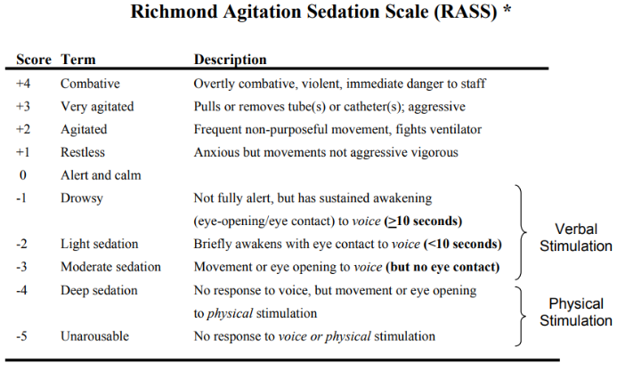
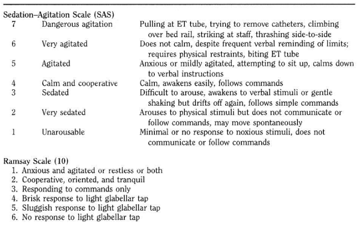

# Final Project: Deep Sedation Across Ethnicities

## Overview of the project 

We are creating a prototype app to sensibilize clinitians on the disparity degree of deep sedation on patients with accute respiratory distress syndrome (ARDS) accross ethnicities. The relevance of this project is that deep sedation on the first five days administered is associated with higher mortality likelihood after 90 days. The first step was to understand two key concepts of the project: ARDS and deep sedation. According to the National Heart, Lung, and Blood institute; ARDS "is a serious lung condition that causes low blood oxygen", this condition is mainly caused by other deseases or injuries. This condition can develop at any age and quickly deteriorate[1].

  
   
  

In the manuscript[2] provided, “deep sedation is defined as the proportion of days during which the patient was deeply sedated, repeatedly measured once daily for the first five days that a patient was alive and receiving mechanical ventilation” (Armstrong-Hough, M. and et.al., 2022). And a day of deep sedation was defined as a day where the Richmond Agitation (Table 1) and Sedation Score [3] was equal to or less than -2, the Riker (Table 1) [3] Sedation Agitation Scale was equal to or greater than 1, or the Ramsay [4] Sedation Scale was equal to or greater than 4. The Richmond Agitation is defined as:

  
**Table 1**

**Table 2**

 

  
In order to assess the disparity in the degree of deep sedation across ethnicities,  the research team control for “patient characteristics, including age, sex, race/ethnicity, reported tobacco use, comorbidities, body mass index (BMI), SOFA score, receipt of benzodiazepines" [3]. And after obtainig the different odds of exposure to deep sedation, they carried out "bivariate tests of association between patient characteristics and death within 90 days using chi-square tests.” The hypothesis that they were testing was “that Hispanic patients enrolled in the control arm of the ROSE trial spent more time deeply sedated than non-Hispanic patients and that greater exposure to deep sedation was associated with increased 90-day mortality” [3].

## Description of the problem
    

Mari Armstrong and her research team made a study on the disparity of deep sedation across ethnicities, and made interesting findings. However, they are looking for a better way to communicate this result to the clinicians (doctors) and clinical scientists (lab savvys). There are two main problems they are looking to solve:

 
 *Sensitize clinitians.
 *Allow clinical scientists to play with the data.
  
## Description of the end user 
 

The end users will be critical care physicians and clinical scientists that have understanding of statistical interpretation of linear regression.

 
## User Research and Testing Plan

### User research plan

Our research method will consist of three stages: Discover, Explore, Test. And these stages are described in the following sections.

 
#### Discover (Designed interview)
Clinician and any other user we have access to will need to answer the following interview questions:
 
* What is the primary patient outcome of interest (deep sedation/ mortality rate)?
* Is the main purpuse of this interactive app to sensibilize clinitians on the disparity of deep sedation?
* How do they expect the visualizations going to help the decision making process, if there is any expectation?
* How do you picture the dynamic visualization?

#### Explore (User’s needs)
Participants will need to prioritize the following needs 

1. 	Statistical precision of modeling.
2. 	Simplicity in conveying a message to the clinitians. 
3. 	Design
4. 	Dynamicity
  
#### Test
This section and the results will be described in the prototyping and developing sections.  

### Testing plan
This testing plan is designed to collect information on the users experience of the Deep Sedation App. Which will help clinitians sensibilize with the disparities on deep sedation. 

#### Purpose, goals, and objectives of the test 
The goals of this test would be to:
*	Asses if the app is helping sensibilize clinitians about the problem. 
* Fine tunning the App prototype. 
  
#### Research questions 
Additionally, this research will try to answer the following questions:  
  
* Do you consider the design is appropriate?
* Did you find the dashboard useful?
* Is the visualization fullfilling the purpose of sensitize?  
* Are the colors used appropriate?
* What would you modify?
  
#### Participant characteristics
There will be two main participants for this App. Professor Mari Armstrong-Hough, and Dr. Tomas Valley.

#### Methodology (test design)

This study will be exploratory to gather information on the purpose fulfilling of this App. The methodology for this study will be a within-subjects study, both participants will try all the sections of the App. We will conduct a 30 minutes to one hour usability study sessions. We will use 5 minutes to introduce the participants to the session, review basic background information with the participants, and allow 15 minutes for the users to test the App. In the last 10 minuteswe will conduct a post-test debriefing interview. If the session could last one hour, each time period will be doubled.

#### Session outline and timing 

The test sessions will be done online over a zoom meeting. And we will schedule the timing later.

#### Pre-test arrangements 
Have the participant:
*	Ask the participants if the session can be recorded. 

#### Introduction to the session (5-10 minutes)
Discuss:
*	Importance of participant's involvement in the study.
*	Moderator’s role.
*	The protocol for the session.

#### Tasks (15-30 min)
Participants will explore the Deep Sedation App. 

#### Post-test debriefing (10-20 min)
*	Ask questions on how this App is addressing the problem on sensibilizing clinitians and allowing clinical scientists to play with the data.
*	Ask questions on the design’s clarity of the App.  
*	Ask how this app could be improved. 
*	Follow up on any problems that came up. 

#### Task list 
1.	Let users interact with the dashboard. 
2.	Let users interact with the visualization.

#### Test environment, equipment, and logistics 
Since the test will be carry out online, the equipment used will depend on the one the participant's have.

#### Test moderator role
The role of the moderator in this study will be a human factors specialist.

#### Data to be collected and evaluation measures
*	Clarity of the dashboard.
*	Clarity of the visualization.
*	Usability for the clinitians.
  
#### Report contents and presentation
The final report will be delivered to the sponsor of the project and will contain:
*	Background of the study, including goals, methodology, and participants characteristics. 
*	Findings for the research questions. 
*	Discussion on the implications of the findings. 
*	Provide recommendations. 
*	Suggest follow-on research. 

## Findings/results from interviews 
 
## Initial interview:
  
* What is the primary patient outcome of interest (deep sedation/ mortality rate)?
  - In the initial interview both participants addrees that both outcomes deep sedation and mortality rate are of interest. However, on later meetings the scope 
  of the project was narrowed to deep sedation. In words of Professor Armstrong-Hough "this is the clearest outcome they have found".
  
* Is the main purpuse of this interactive app to sensibilize clinitians on the disparity of deep sedation?
  - From the initial interview with Professor Mari Armstrong-Hough, that is our understanding. However, they would also like to see a section where technical   
  clinicians could play with the data. 
  
* How do they expect the visualizations going to help the decision making process, if there is any expectation?
  - The want to sensibilize about the disparity to create awareness of the problem and its implications. 
  
* How do you picture the dynamic visualization?
  -Mostly we have discussed a dashboard with dynamic tables. 
  
## Test interview:
  
  We showed our stakeholders the first draft of our idea. Even when we did not had a completed app, they were able to visualize the proposed structure.
  
* Do you consider the design is appropriate?
  -They mentioned that they would like to see the visualization with the tables side by side. 
  
* Did you find the dashboard useful?
  -They found the dashboard would be useful for the technical scientists. 
  
* Is the visualization fullfilling the purpose of sensitize?  
  -They like the idea on the emotional design of the visualization to sensitize clinitians.  
  
* Are the colors used appropriate?
  -We were not able to address this question in this first round. 
  
* What would you modify?
  -Our original design had two tabs, one for the dashboard and one for the visualization. However, they mentioned they would like to see it side by side. 
  
## Prototyping round 1

So far we are envisioning a dashboard that ilustrates the odds of exposure to deep sedation given ethnicities and other characteristics. And a visualization that illustrates the disparities on deep sedation accross ethnicities.

 
## Developments after round 1
## Plan for testing or getting feedback on the first round prototype
## Second round prototype - Application 
## Describe the latest version and, if applicable, any feedback you received (you may not get to this stage of feedback on the latest version)
## Link of Published Application
## Potential next steps
## References
[1] “Acute Respiratory Distress Syndrome - What Is Acute Respiratory Distress Syndrome? | NHLBI, NIH.” National Heart, Lung, and Blood Institute, 24 Mar. 2022, www.nhlbi.nih.gov/health/ards.
   
[2] Armstroung-Hough, Mari. “Ethnic disparities in deep sedation of patients with ARDS in the United States: secondary analysis of a multicenter randomized trial”.  (I am not sure how to reference it without the DOI. we need to check)
   
[3] “Richmond Agitation Sedation Scale (RASS) - Mnhospitals.org.” Richmond Agitation Sedation Scale (RASS), https://www.mnhospitals.org/Portals/0/Documents/ptsafety/LEAPT%20Delirium/RASS%20Sedation%20Assessment%20Tool.pdf.
   
[4] “Riker Sedation Agitation Scale (SAS) - SCCM.” Sedation Agitation Scale, Wolters Kluwer Health, 1999, https://www.sccm.org/getattachment/2af9bf9a-ccd9-47fe-9e1a-435186db4cb8/Riker-Sedation-Agitation-Scale-(SAS).
    
[5] “What Is User Research?” The Interaction Design Foundation, https://www.interaction-design.org/literature/topics/user-research.  
  
[6] Rubin, Jeffrey, and Dana Chisnell. Handbook of Usability Testing: How to Plan, Design, and Conduct Effective Tests, John Wiley & Sons, Incorporated, 2008. ProQuest Ebook Central, https://ebookcentral-proquest-com.proxy.library.nyu.edu/lib/nyulibrary-ebooks/detail.action?docID=343716. 

## Note

Further information on the research, design process can be found in the following file:
https://drive.google.com/drive/folders/1lBiena62lc3Bb47pauYFTSbWYFz8CrRj
